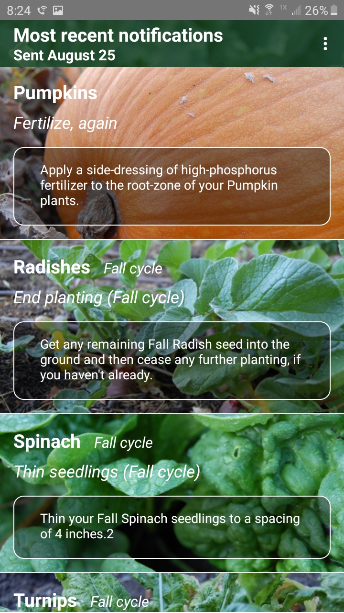
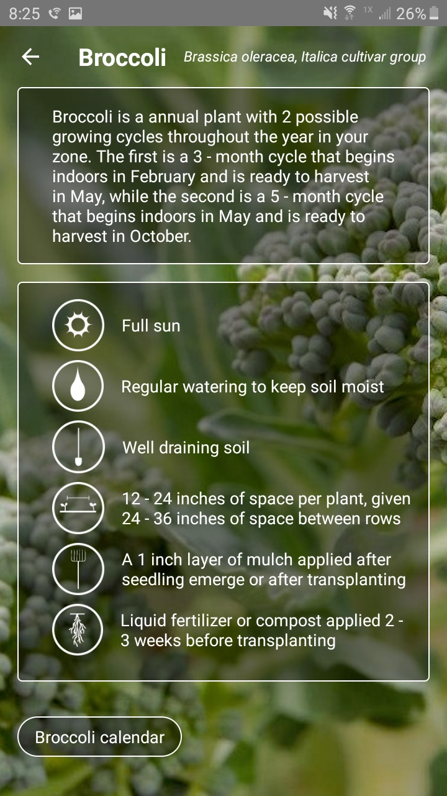
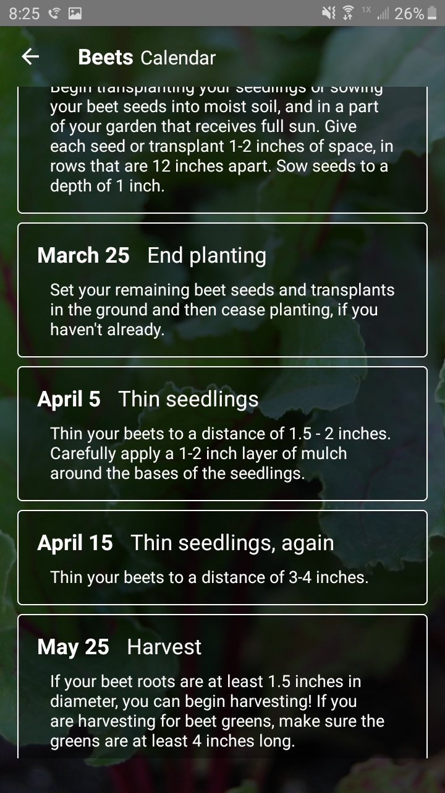
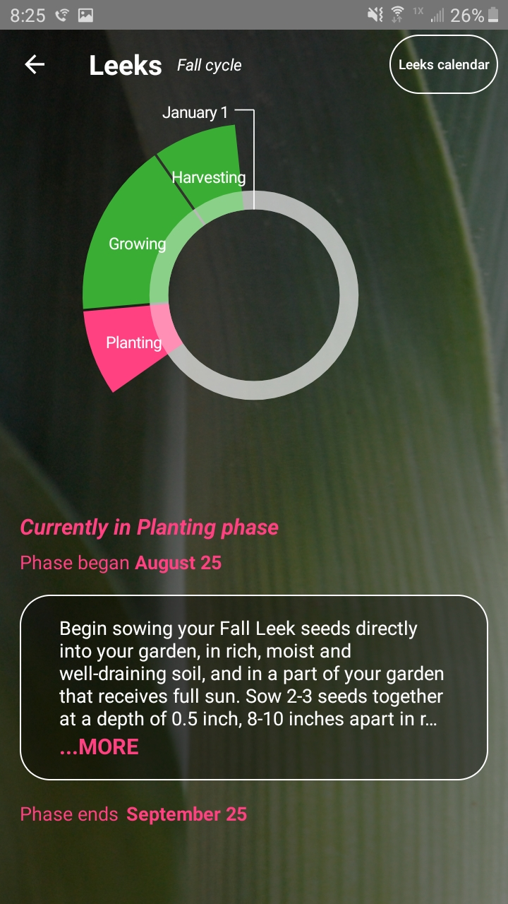

# Growminder

Growminder application built for Android. All data is internal, thereby eliminating any network dependencies. Built on a SQLite instance, with all of the usual Android stuff, including Notifications, which at this time, may be obsolete since it seems like Android Notifications have undergone some changes since the last development iteration. In other words, the Notification system may not function as it should. 

 hwdouhweoiweh

